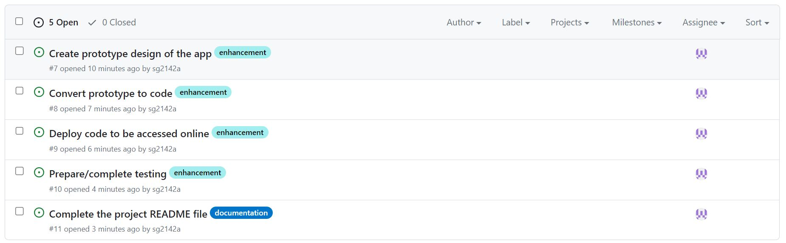
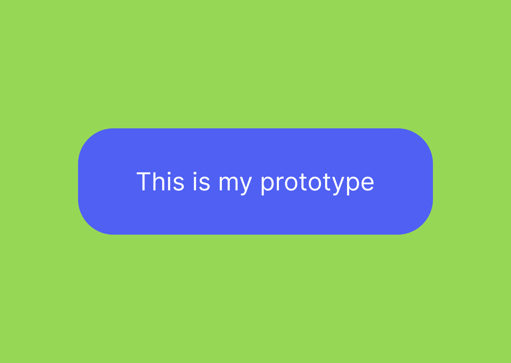
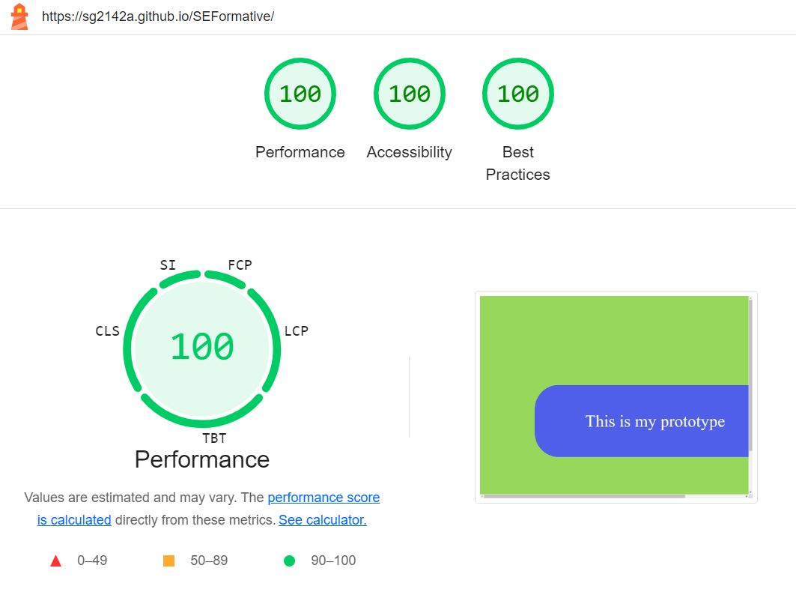

# SEFormative
Formative Assignment for the Software Engineering course

## Introduction
For the formative assignment for this course, we have to create a basic application using a programming language such as HTML, CSS or Vanilla JS. We will then need to deploy this using a remote repository, in this case Github, and document our processes in doing so.

## Project Tasks
Using the issues section of Github, I created tickets for each of the tasks I wanted to carry out in this assignment, starting from an initial prototype of the design through to testing a deployed product. The task list can be seen below.

## Figma Prototype
The prototype design for the app can be seen below. At this stage, it is a basic, non-responsive site serving the purpose of demonstrating the processes behind such a project, rather than being focused on the product itself.

## Creation of the code
To code my application, I used git at the terminal line to clone my project, subsequently opening it using Visual Studio Code. Having designed my prototype on Figma, the site allows you to copy your design as CSS, which allowed me to transfer my design straight over to my coding studio. I used CSS classes to define my background, along with the box and the text within it, and then deployed this through HTML. I used a boilerplate HTML template through Emmet to initialise this app, and the CSS code within it to deploy the app. Once this was done, I used three commands on Visual Studio Code's terminal- git add, commit and push to move it back to my online repository.

## Deployment of code in app
The deployed code can be found at [this link](https://sg2142a.github.io/SEFormative/)

## Opportunity for feedback
In order to receive some feedback on the initial prototype and design, a [Google Form](https://forms.gle/gXe7pYgGF7gshvPL9) has been created. Please feel free to submit feedback

## Accessibility Testing
Through Google Lighthouse, I ran some accessibility testing on Performance, Accessibility and Best Practice- the results can be seen below.

The results of the testing were extremely positive, with the application scoring 100 (the highest possible score) on all three metrics, suggesting that this is a highly accessible app.
